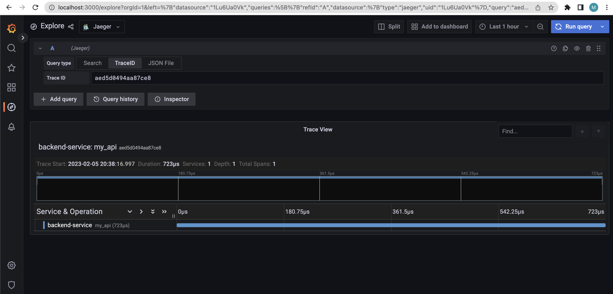

**Note:** For the screenshots, you can store all of your answer images in the `answer-img` directory.

## Verify the monitoring installation

## Setup the Jaeger and Prometheus source

## Create a Basic Dashboard
 Create a dashboard in Grafana that shows Prometheus as a source. Take a screenshot and include it here.

## Describe SLO/SLI
Describe, in your own words, what the SLIs are, based on an SLO of *monthly uptime* and *request response time*.
* SLO: Service level objective - an objective that has to be met
* SLI: Service level indicator - used to determine if a service meets its SLO or not. 

- With an SLO saying something about *Monthly uptime* the SLI would most likely be some measurement
of how much time the service was available given the specific month in which the SLO is measured.
- With an SLO saying something about *request response time* the SLI would most likely be some measurement
of how much time the service belonging to the SLO would take to respond to a request.
These SLIs provide a way to quantitatively assess whether a service is meeting its stated objectives.

## Creating SLI metrics.
It is important to know why we want to measure certain metrics for our customer. Describe in detail 5 metrics to measure these SLIs. 
request response time 

* Service response time - measure how long does it take for the service to respond to the request. Measure the time it 
takes form for the initial request to the service until the service responds back.  
* Error rate for requests - measure how many of the requests towards a specific applications results in an error. Measured
by counting the erroneous requests and dividing it by the total amount of requests made to the service. 
monthly uptime
* Latency - Measurement of the total amount of time from when a request is sent from a client, until the client receives a response.
* Availability of the service - Measurement of how available a service is. Measure the total amount the service was down and dividing it by the total amount of time in a month
* Throughput - Measurement of how many request the service can handle over a given period of time. Measured by counting the number of requests
made to the service over a period of time.

## Create a Dashboard to measure our SLIs
Create a dashboard to measure the uptime of the frontend and backend services.
We will also want to measure 40x and 50x errors.
Create a dashboard that show these values over a 24 hour period and take a screenshot.

## Tracing our Flask App
We will create a Jaeger span to measure the processes on the backend.
Once you fill in the span, provide a screenshot of it here. 
Also provide a (screenshot) sample Python file containing a 
trace and span code used to perform Jaeger traces on the backend service.
`Tracer`

`Jaeger`

## Jaeger in Dashboards
Now that the trace is running, let's add the metric to our current
Grafana dashboard. 
Once this is completed, provide a screenshot of it here.

## Report Error
Using the template below, write a trouble ticket for the developers, to explain the errors that you are seeing
(400, 500, latency) and to let them know the file that is causing the issue also include a screenshot of the tracer span 
to demonstrate how we can user a tracer to locate errors easily.

TROUBLE TICKET

Name: GET http://localhost:8081/help 404 (NOT FOUND)

Date: 2022-03-05

Subject: URL not found

Affected Area: Backend service

Severity: Low

Description: Uri requested for backend-services is not found trace-id:8e850abb0fa0e680

## Creating SLIs and SLOs
We want to create an SLO guaranteeing that our application has a 99.95% uptime per month.
Name four SLIs that you would use to measure the success of this SLO.

1. Error budget of 0.05% for 50x and 40x status codes -> Errors
2. 99.95% of the requests should return an HTTP 200 -> Traffic
3. The CPU should always operate in the range between 0.05-99.95 % -> Availability
2. Memory usage should be in range between 0.05-99.95 % -> Saturation
(ranges are set based on some usage of the resources but no exhaustion of them)

## Building KPIs for our plan
Now that we have our SLIs and SLOs, create a list of 2-3 KPIs to accurately measure these metrics as well as
a description of why those KPIs were chosen. We will make a dashboard for this, but first write them down here.

Errors: Counting the amount of 40x and 50x status codes from the application and divining it by the total request gives us an instant overview of 
how well out application is handling the traffic at an instance.
Traffic: counting the amount of 20x status codes from the application and divining it by the total request gives us an instant overview of 
how well out application is handling the traffic at an instance.
Availability: Service should always be available and not busy, process_cpu_seconds_total can be used to measure the CPU usage
Saturation:  Memory saturations can lead to outages, container_memory_max_usage_bytes can be used to measure memory usage

## Final Dashboard
Create a Dashboard containing graphs that capture all the metrics of your KPIs and adequately representing
your SLIs and SLOs. Include a screenshot of the dashboard here, and write a text description of what graphs
are represented in the dashboard.  

* `4xx & 5xx status responses`: count of 4xx and 5xx responses from backend and frontend services
* ` 200 status responses`: count of 200 responses from backend and frontend services 
* `CPU seconds total`: CPU usage of the backend application
* `Memory usage bytes`: Memory usage of the backend applications